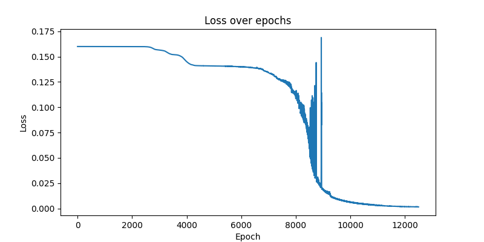
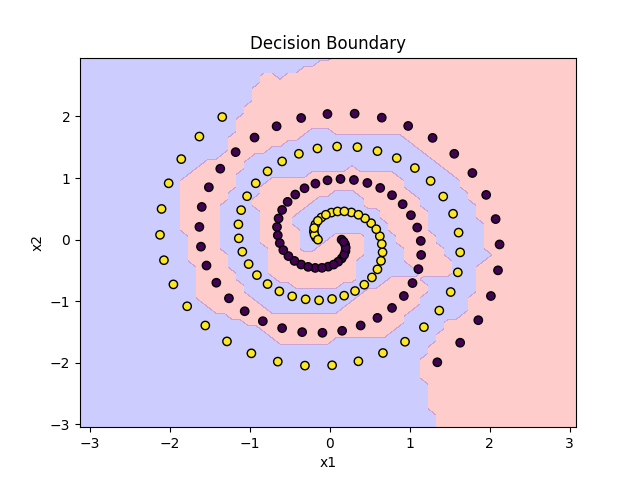

# 簡単なニューラルネットワークの実装
機械学習フレームワークなしでニューラルネットワークを実装した．

## 実行
```bash
cd src
python main.py
```

## モデル
`/assets/src/main.py`をいじるといろいろ試せる．

```python
layer_sizes = [2, 20, 10, 1]  # 入力層、隠れ層1、隠れ層2、出力層
learning_rate = 0.01
epochs = 12500 + 1
```

## 例題：ネストスパイラル
`assets/data/`下にcsvとxlsxがある．
座標情報と正解ラベルが入っている．



